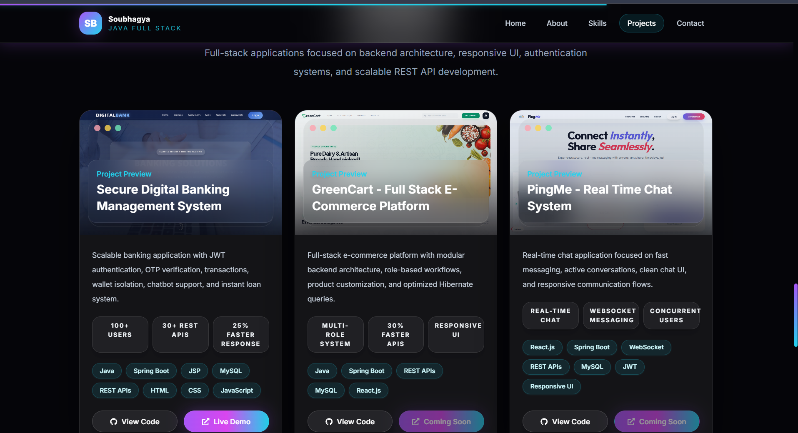
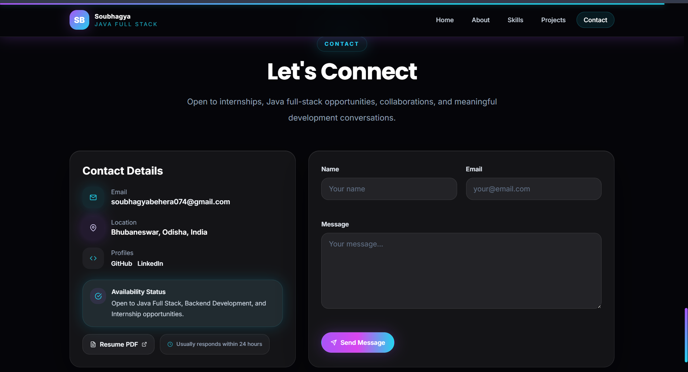

# 🚀 Soubhagya Portfolio

Modern responsive developer portfolio built using React, Vite, Tailwind CSS, and EmailJS.

---

## 🌐 Live Demo

Coming Soon

---

## ✨ Features

- Modern responsive UI
- Smooth scrolling experience
- Contact form with EmailJS
- Resume download option
- GitHub & LinkedIn integration
- Mobile friendly design
- Animated sections and glassmorphism UI

---

## 🛠️ Tech Stack

- React.js
- Vite
- Tailwind CSS
- JavaScript
- EmailJS
- React Icons

---

## 📸 Screenshots

### Home Page


---

### Projects Section



---

### Contact Section



---

## 📂 Project Structure

```bash
frontend/
├── public/
├── src/
│   ├── assets/
│   ├── components/
│   ├── data/
│   ├── pages/
│   └── App.jsx
├── package.json
└── vite.config.js
```

---

## ⚙️ Installation & Setup

Clone the repository

```bash
git clone https://github.com/your-username/Soubhagya-Portfolio.git
```

Move to project folder

```bash
cd Soubhagya-Portfolio/frontend
```

Install dependencies

```bash
npm install
```

Run locally

```bash
npm run dev
```

---

## 🔐 Environment Variables

Create `.env` file inside frontend folder:

```env
VITE_EMAILJS_SERVICE_ID=your_service_id
VITE_EMAILJS_TEMPLATE_ID=your_template_id
VITE_EMAILJS_PUBLIC_KEY=your_public_key
```

---

## 👨‍💻 Author

Soubhagya Kumar Behera

- GitHub: https://github.com/soubhagya-behera
- LinkedIn: Add your LinkedIn link here

---

## ⭐ Support

If you like this project, give it a star ⭐
